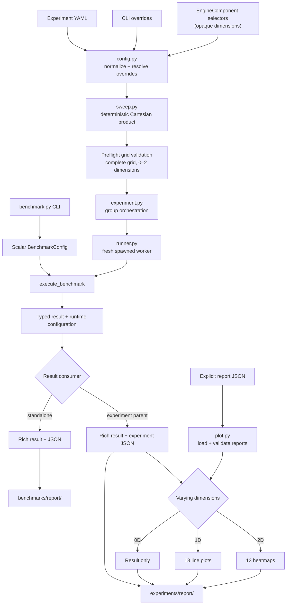

<div align="center">

<h1>Ultra-Nano-vLLM</h1>

<h1>TODO: Update README for profiling...</h1>

<p><strong>Measure. Isolate. Profile. Optimize.</strong></p>
<p>A reproducible performance-research workflow for nano-vLLM.</p>

<p>
  <a href="pyproject.toml"></a>
  <a href="#installation"></a>
  <a href="#research-workflow"></a>
  <a href="LICENSE"></a>
</p>

<p>
  <a href="README.md">English</a> ·
  <a href="README.zh-TW.md">繁體中文</a> ·
  <a href="README.zh-CN.md">简体中文</a>
</p>

<p>
  <a href="#architecture">Architecture</a> ·
  <a href="#installation">Installation</a> ·
  <a href="#benchmark">Benchmark</a> ·
  <a href="#experiments">Experiments</a> ·
  <a href="#pluggable-design">Pluggable Design</a> ·
  <a href="#research-workflow">Research Workflow</a>
</p>

</div>

Ultra-Nano-vLLM is a performance research project built around
[nano-vLLM](https://github.com/GeeeekExplorer/nano-vllm). It turns a lightweight
inference engine into a controlled environment for measuring changes, profiling
confirmed bottlenecks, and checking optimizations against reproducible baselines.

| Benchmark | Experiment | Optimize |
| --- | --- | --- |
| Record structured latency, throughput, and KV-cache occupancy measurements. | Isolate scalar, component, and kernel effects with validated YAML grids. | Profile confirmed workloads, replace focused implementations, and compare regressions. |

> **Research loop:** benchmark → controlled experiment → profiling → optimization → regression comparison

<a id="architecture"></a>

## Architecture

The research path is deliberately separate from inference-engine details.
Benchmark and experiment entrypoints transport an opaque `EngineComponent`
selection but never decide how an engine component is implemented. See
[Pluggable Design](#pluggable-design) for the replacement contract.



### Source map

| Area | Responsibility |
| --- | --- |
| `benchmarks/benchmark.py` | Defines one scalar benchmark configuration and measurement lifecycle. |
| `benchmarks/runner.py` | Adapts a workload to the LLM API and captures runtime and KV-cache block usage. |
| `experiments/config.py` | Loads YAML, applies overrides, infers dimensions, and validates grids. |
| `experiments/sweep.py` | Expands normalized options in deterministic Cartesian-product order. |
| `experiments/experiment.py` | Orchestrates groups, parent-side reporting, and plot dispatch. |
| `experiments/runner.py` | Runs each scalar configuration in a fresh spawned process. |
| `experiments/plot.py` | Loads reports and renders dimension-specific comparisons. |
| `utils/reporter.py` | Displays Rich output and persists typed JSON reports. |

Architecture invariants:

- Benchmark and experiment entrypoints remain engine-agnostic.
- Each YAML file forms an independent plotting group.
- Complete, unique grids of at most two dimensions are validated before GPU work.
- Scalar experiment runs are sequential, process-isolated, and request explicit cleanup.
- Typed results return to the parent process for reporting and plotting.
- Plot-only mode reads only the report files explicitly supplied by the user.

<a id="installation"></a>

## Installation

<details open>
<summary><strong>Environment and dependencies</strong></summary>

<br>

Ultra-Nano-vLLM supports Python 3.10–3.12 and requires an NVIDIA GPU, a
compatible CUDA environment, PyTorch, Triton, and FlashAttention. The commands
below target CUDA 12.8; use the command generated by the
[PyTorch installer](https://pytorch.org/get-started/locally/) when your CUDA
environment differs.

```bash
python -m venv .venv
source .venv/bin/activate
python -m pip install --upgrade pip setuptools wheel
python -m pip install torch==2.8.0 --index-url https://download.pytorch.org/whl/cu128
python -m pip install ninja packaging psutil
MAX_JOBS=2 python -m pip install "flash-attn>=2.8.3,<2.9" --no-build-isolation
python -m pip install -e .
```

`MAX_JOBS=2` limits FlashAttention build memory usage and can be adjusted for
your machine.

</details>

<details open>
<summary><strong>Local model setup</strong></summary>

<br>

Benchmarks use a local model path. The included experiment configurations
default to `~/huggingface/Qwen3-0.6B/`. For example:

```bash
huggingface-cli download --resume-download Qwen/Qwen3-0.6B \
  --local-dir ~/huggingface/Qwen3-0.6B/ \
  --local-dir-use-symlinks False
```

</details>

<a id="benchmark"></a>

## Run a benchmark

Use `benchmarks/benchmark.py` for one scalar configuration:

```bash
python benchmarks/benchmark.py \
  --model ~/huggingface/Qwen3-0.6B/ \
  --num-requests 256 \
  --input-len 1024 \
  --output-len 256 \
  --max-model-len 8192 \
  --temperature 0 \
  --repeats 3 \
  --experiment-name baseline
```

`temperature: 0` selects greedy decoding. Positive temperatures use stochastic
sampling. Add `--enforce-eager` to disable CUDA graph execution.
`input_len + output_len` must not exceed `max_model_len`. The engine also caps
the effective value at the model's `max_position_embeddings`. The field defaults
to `8192` when omitted; repository experiment configs also set it explicitly.

The benchmark prints a Rich result table and writes a JSON report under
`benchmarks/report/`. Each report includes workload totals, median/minimum/
maximum/mean/standard-deviation summaries, request latency p50/p90/p99,
prefill/decode time and throughput, peak used KV-cache blocks, and peak KV-cache
utilization.

<a id="experiments"></a>

## Run controlled experiments

An experiment YAML may provide either one value or a list of values for each
field. Lists are expanded as a deterministic Cartesian product. Every expanded
run needs a unique `experiment_name`.

```yaml
model: ~/huggingface/Qwen3-0.6B/
num_requests: 256
input_len: [512, 1024]
output_len: 256
max_model_len: 8192
seed: 0
temperature: 0
repeats: 3
enforce_eager: [false, true]

scheduler: scheduler
block_manager: block_manager
attention: attention
sampler: sampler
store_kvcache: store_kvcache

experiment_name:
  - input-512-cuda-graph
  - input-512-eager
  - input-1024-cuda-graph
  - input-1024-eager
```

This is a complete two-dimensional grid (`input_len` × `enforce_eager`). Run it
with:

```bash
python experiments/experiment.py --config experiments/configs/your-config.yaml
```

Pass `--config` repeatedly to execute multiple YAML files. Each file remains an
independent plotting group:

```bash
python experiments/experiment.py \
  --config experiments/configs/baseline-input-sweeps.yaml \
  --config experiments/configs/baseline-output-sweeps.yaml
```

### Shipped baseline suite

The repository baseline uses greedy decoding, CUDA graphs, `max_model_len: 8192`,
and seven measured repeats per point. Shorter sequences keep the suite practical,
while the final point of each sweep is expected to saturate the logical KV cache.

| Config | Fixed workload | Sweep values |
| --- | --- | --- |
| `baseline-req-sweeps.yaml` | input 256, output 256 | requests: 16, 32, 64, 128, 256 |
| `baseline-input-sweeps.yaml` | 64 requests, output 256 | input: 128, 256, 512, 1024, 2048 |
| `baseline-output-sweeps.yaml` | 128 requests, input 256 | output: 64, 128, 256, 512, 768 |

Reports produced by the earlier 4096-context workloads remain useful as
historical characterization, but should not be mixed into a new baseline plot.

Benchmark CLI options can override scalar YAML values for the invocation:

```bash
python experiments/experiment.py \
  --config experiments/configs/baseline-input-sweeps.yaml \
  --temperature 0 \
  --repeats 5
```

Experiment groups may vary at most two scalar, component, or kernel dimensions.
The complete grid and globally unique experiment names are validated before any
GPU work begins. Every scalar configuration runs sequentially in a fresh
spawned process so CUDA graph pools, cached allocations, and NCCL process-group
state cannot leak into the next measurement.

Reports and PNG plots are written to `experiments/report/`:

- 0 varying dimensions: Rich result and JSON report only.
- 1 varying dimension: thirteen mean line charts; summarized metrics include
  standard-deviation bands.
- 2 varying dimensions: thirteen annotated mean heatmaps; summarized metric
  cells also show standard deviation.

The thirteen plotted metrics cover elapsed time, latency p50/p90/p99, request,
output, total, prefill, and decode throughput, prefill/decode time, and the two
KV-cache occupancy metrics. Output and total throughput remain available because
they describe end-to-end serving rates rather than phase-local execution rates.

Existing experiment reports can be plotted again without running the model:

```bash
python experiments/experiment.py --plot-only \
  experiments/report/run-a.json \
  experiments/report/run-b.json
```

Only the explicitly listed reports form the plotting group. They must contain
compatible `experiment_config` and result payloads. Reports containing only the
legacy GPU allocator peak fields or lacking latency/phase metrics must be
regenerated before using plot-only mode.

<a id="pluggable-design"></a>

## Pluggable components and kernels

`EngineComponent` keeps the benchmark and experiment entrypoints independent of
inference-engine implementation details. Each selector is a safe local filename
stem in a fixed role directory; hyphenated names such as
`my-scheduler-v1.py` are supported, while paths and `..` are rejected.

<details>
<summary><strong>Implementation contract and Python API</strong></summary>

<br>

| YAML selector | Implementation location | Required factory |
| --- | --- | --- |
| `scheduler` | `nanovllm/engine/scheduler/<selector>.py` | `create_component(config=..., block_manager=...)` |
| `block_manager` | `nanovllm/engine/block_manager/<selector>.py` | `create_component(num_blocks=..., block_size=...)` |
| `attention` | `nanovllm/layers/attention/<selector>.py` | `create_component(num_heads=..., head_dim=..., scale=..., num_kv_heads=..., store_kvcache=...)` |
| `sampler` | `nanovllm/layers/sampler/<selector>.py` | `create_component()` |
| `store_kvcache` | `nanovllm/kernels/store_kvcache/<selector>.py` | `create_kernel()` |

Factory results must satisfy the runtime-checkable Protocol for their role in
`nanovllm.engine.component`. The attention factory receives the selected
store-KV-cache callable, so Triton or CUDA kernel wrappers can participate in
the same replacement mechanism. Omitted selectors use the baseline filenames
shown in the YAML example above.

To compare a new scheduler, first add
`nanovllm/engine/scheduler/my-scheduler-v1.py` with the required factory, then
configure the categorical sweep:

```yaml
scheduler: [scheduler, my-scheduler-v1]
block_manager: block_manager
attention: attention
sampler: sampler
store_kvcache: store_kvcache
```

`my-scheduler-v1` is an illustrative name, not a bundled implementation. The
same convention applies to the other component and kernel directories.

The selection API is also available to Python callers:

```python
from nanovllm import EngineComponent, LLM

components = EngineComponent(scheduler="my-scheduler-v1")
llm = LLM(
    "/YOUR/MODEL/PATH",
    enforce_eager=True,
    tensor_parallel_size=1,
    engine_component=components,
)
```

</details>

<a id="research-workflow"></a>

## Research workflow

1. Establish a reproducible scalar benchmark for the workload of interest.
2. Use a one- or two-dimensional experiment to isolate the relevant effect.
3. Profile the confirmed workload and identify the actual bottleneck.
4. Add a focused component, kernel, or engine optimization while preserving
   correctness and public behavior.
5. Re-run the same benchmark grid and compare the saved reports for performance
   improvement and regressions.

The repository does not currently mandate a profiling framework, command, or
artifact directory.

<details>
<summary><strong>Development verification</strong></summary>

<br>

Prefer the repository virtual environment when it exists:

```bash
.venv/bin/python -m unittest discover
.venv/bin/python -m compileall -q benchmarks experiments nanovllm utils
git diff --check
```

Use `python3` instead of `.venv/bin/python` when the virtual environment is not
available. Unit tests should mock model loading and expensive GPU work; do not
run real benchmarks without a suitable NVIDIA GPU, CUDA environment, and local
model.

Generated output under `benchmarks/report/` and `experiments/report/` should
remain untracked.

</details>

## Relationship to nano-vLLM

Ultra-Nano-vLLM is built on the lightweight inference engine from
[GeeeekExplorer/nano-vllm](https://github.com/GeeeekExplorer/nano-vllm). The
upstream project provides the readable nano-vLLM implementation; this repository
adds the benchmark, controlled experiment, reporting, plotting, isolation, and
pluggable-selection infrastructure needed for an evidence-driven optimization
workflow.

See [LICENSE](LICENSE) for licensing information.
