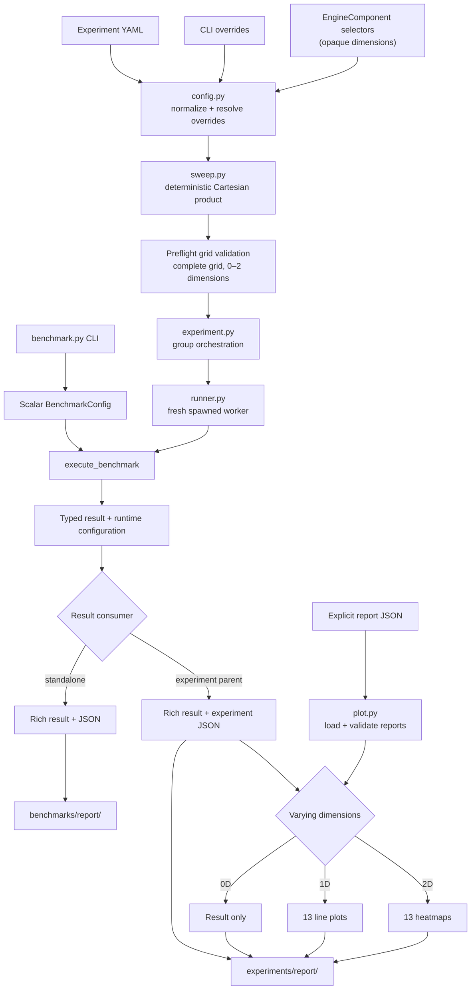

<div align="center">

<h1>Ultra-Nano-vLLM</h1>

<p><strong>测量、隔离、分析、优化。</strong></p>
<p>为 nano-vLLM 构建的可复现性能研究工作流。</p>

<p>
  <a href="pyproject.toml"></a>
  <a href="#installation"></a>
  <a href="#research-workflow"></a>
  <a href="LICENSE"></a>
</p>

<p>
  <a href="README.md">English</a> ·
  <a href="README.zh-TW.md">繁體中文</a> ·
  <a href="README.zh-CN.md">简体中文</a>
</p>

<p>
  <a href="#architecture">架构</a> ·
  <a href="#installation">安装</a> ·
  <a href="#benchmark">Benchmark</a> ·
  <a href="#experiments">Experiment</a> ·
  <a href="#pluggable-design">可插拔设计</a> ·
  <a href="#research-workflow">研究流程</a>
</p>

</div>

Ultra-Nano-vLLM 是一个以
[nano-vLLM](https://github.com/GeeeekExplorer/nano-vllm) 为基础的性能研究项目。
它将轻量推理引擎转化为受控研究环境，用于测量变更、分析已确认的瓶颈，
并以可复现的 baseline 验证优化结果。

| Benchmark | Experiment | Optimize |
| --- | --- | --- |
| 记录结构化的延迟、吞吐量与 KV-cache 使用量测量。 | 通过已验证的 YAML 网格隔离 scalar、component 与 kernel 的影响。 | Profile 已确认的 workload、替换聚焦的实现并比较 regression。 |

> **研究循环：** benchmark → controlled experiment → profiling → optimization → regression comparison

<a id="architecture"></a>

## 架构

研究流程刻意与推理引擎实现细节分离。Benchmark 与 experiment entrypoint
只传递不透明的 `EngineComponent` selection，不决定组件如何实现。
替换 contract 请参阅[可插拔设计](#pluggable-design)。



### 源代码导览

| 区域 | 职责 |
| --- | --- |
| `benchmarks/benchmark.py` | 定义单次 scalar benchmark config 与测量生命周期。 |
| `benchmarks/runner.py` | 将 workload 接至 LLM API，并采集 runtime 与 KV-cache block 使用量。 |
| `experiments/config.py` | 加载 YAML、应用 override、推断维度并验证网格。 |
| `experiments/sweep.py` | 按确定性的笛卡尔积顺序展开规范化选项。 |
| `experiments/experiment.py` | 编排分组、parent-side reporting 与 plot dispatch。 |
| `experiments/runner.py` | 在全新的 spawned process 中执行每组 scalar config。 |
| `experiments/plot.py` | 加载报告并绘制不同维度的比较图。 |
| `utils/reporter.py` | 显示 Rich 输出并保存 typed JSON report。 |

架构不变条件：

- Benchmark 与 experiment entrypoint 保持 engine-agnostic。
- 每个 YAML 文件分别形成独立的绘图组。
- GPU 工作开始前，必须验证最多二维且完整、唯一的参数网格。
- Scalar experiment 依次执行、使用独立 process，并要求明确 cleanup。
- Typed result 返回 parent process 后才进行 reporting 与 plotting。
- Plot-only mode 只读取用户明确提供的 report file。

<a id="installation"></a>

## 安装

<details open>
<summary><strong>环境与依赖</strong></summary>

<br>

Ultra-Nano-vLLM 支持 Python 3.10–3.12，并需要 NVIDIA GPU、兼容的 CUDA 环境、
PyTorch、Triton 与 FlashAttention。以下命令以 CUDA 12.8 为目标；如果 CUDA 环境不同，
请使用 [PyTorch installer](https://pytorch.org/get-started/locally/) 生成的命令。

```bash
python -m venv .venv
source .venv/bin/activate
python -m pip install --upgrade pip setuptools wheel
python -m pip install torch==2.8.0 --index-url https://download.pytorch.org/whl/cu128
python -m pip install ninja packaging psutil
MAX_JOBS=2 python -m pip install "flash-attn>=2.8.3,<2.9" --no-build-isolation
python -m pip install -e .
```

`MAX_JOBS=2` 用于限制构建 FlashAttention 时的内存用量，可根据机器资源调整。

</details>

<details open>
<summary><strong>本地模型准备</strong></summary>

<br>

Benchmark 使用本地模型路径。随附的 experiment config 默认使用
`~/huggingface/Qwen3-0.6B/`，例如：

```bash
huggingface-cli download --resume-download Qwen/Qwen3-0.6B \
  --local-dir ~/huggingface/Qwen3-0.6B/ \
  --local-dir-use-symlinks False
```

</details>

<a id="benchmark"></a>

## 运行 Benchmark

使用 `benchmarks/benchmark.py` 执行一组 scalar config：

```bash
python benchmarks/benchmark.py \
  --model ~/huggingface/Qwen3-0.6B/ \
  --num-requests 256 \
  --input-len 1024 \
  --output-len 256 \
  --max-model-len 8192 \
  --temperature 0 \
  --repeats 3 \
  --experiment-name baseline
```

`temperature: 0` 表示 greedy decoding；正温度使用 stochastic sampling。
添加 `--enforce-eager` 可禁用 CUDA graph 执行。
`input_len + output_len` 不得超过 `max_model_len`；engine 也会根据模型的
`max_position_embeddings` 限制 effective value。省略该字段时默认为 `8192`；
repository experiment configs 也会明确设置该值。

Benchmark 会显示 Rich 结果表，并将 JSON 报告写入 `benchmarks/report/`。
每份报告包含 workload 总量、时间与吞吐量的 median/minimum/maximum/mean/
standard deviation、request latency p50/p90/p99、prefill/decode 时间与吞吐量，
以及 KV-cache peak used blocks 与 peak utilization。

<a id="experiments"></a>

## 运行受控 Experiment

Experiment YAML 的每个字段都可以提供单个值或值列表。列表会展开为确定性的笛卡尔积，
且每个展开后的 run 都必须具有唯一的 `experiment_name`。

```yaml
model: ~/huggingface/Qwen3-0.6B/
num_requests: 256
input_len: [512, 1024]
output_len: 256
max_model_len: 8192
seed: 0
temperature: 0
repeats: 3
enforce_eager: [false, true]

scheduler: scheduler
block_manager: block_manager
attention: attention
sampler: sampler
store_kvcache: store_kvcache

experiment_name:
  - input-512-cuda-graph
  - input-512-eager
  - input-1024-cuda-graph
  - input-1024-eager
```

这是一个完整的二维网格（`input_len` × `enforce_eager`）。运行方式如下：

```bash
python experiments/experiment.py --config experiments/configs/your-config.yaml
```

重复传入 `--config` 可以执行多个 YAML；每个文件仍是独立的绘图组：

```bash
python experiments/experiment.py \
  --config experiments/configs/baseline-input-sweeps.yaml \
  --config experiments/configs/baseline-output-sweeps.yaml
```

### Shipped Baseline Suite

Repository baseline 使用 greedy decoding、CUDA graphs、`max_model_len: 8192`，
且每个点运行七次 measured repeats。较短的 sequence 让完整 suite 保持可执行，
每个 sweep 的最后一点则预期会使 logical KV cache 饱和。

| Config | 固定 workload | Sweep values |
| --- | --- | --- |
| `baseline-req-sweeps.yaml` | input 256、output 256 | requests：16、32、64、128、256 |
| `baseline-input-sweeps.yaml` | 64 requests、output 256 | input：128、256、512、1024、2048 |
| `baseline-output-sweeps.yaml` | 128 requests、input 256 | output：64、128、256、512、768 |

此前以 4096 context 生成的报告仍可作为历史 characterization，但不应混入新的
baseline plot。

Benchmark CLI option 可以在该次执行中覆盖 YAML 的 scalar value：

```bash
python experiments/experiment.py \
  --config experiments/configs/baseline-input-sweeps.yaml \
  --temperature 0 \
  --repeats 5
```

每个 experiment group 最多只能变化两个 scalar、component 或 kernel 维度。
完整网格与全局唯一的 experiment name 会在任何 GPU 工作开始前完成验证。
每组 scalar config 会依次在全新的 spawned process 中执行，避免 CUDA graph pool、
cached allocation 或 NCCL process-group state 泄漏至下一次测量。

报告与 PNG 图表会写入 `experiments/report/`：

- 0 个变化维度：仅生成 Rich 结果和 JSON 报告。
- 1 个变化维度：生成十三张 mean 折线图；summary 指标包含 standard-deviation band。
- 2 个变化维度：生成十三张标注 mean 的 heatmap；summary 指标 cell 也会显示 standard deviation。

十三项绘图指标涵盖 elapsed time、latency p50/p90/p99、request/output/total/prefill/
decode throughput、prefill/decode time，以及两项 KV-cache 使用量指标。Output 与 total
throughput 仍予保留，因为它们描述端到端服务率，而非单一 phase 的执行率。

可以只使用现有 experiment 报告重新绘图，而不运行模型：

```bash
python experiments/experiment.py --plot-only \
  experiments/report/run-a.json \
  experiments/report/run-b.json
```

只有明确列出的报告会组成该绘图组，且必须包含兼容的 `experiment_config` 与 result payload。
仅包含旧版 GPU allocator peak 字段的报告，必须重新运行实验后才能用于 plot-only mode。
缺少 latency/phase 指标的旧报告也必须重新运行实验。

<a id="pluggable-design"></a>

## 可插拔的 Component 与 Kernel

`EngineComponent` 让 benchmark 与 experiment entrypoint 无需理解推理引擎的实现细节。
每个 selector 都是固定角色目录下的安全本地文件名 stem；支持 `my-scheduler-v1.py`
这类带连字符的名称，但拒绝 path 与 `..`。

<details>
<summary><strong>Implementation contract 与 Python API</strong></summary>

<br>

| YAML selector | Implementation location | Required factory |
| --- | --- | --- |
| `scheduler` | `nanovllm/engine/scheduler/<selector>.py` | `create_component(config=..., block_manager=...)` |
| `block_manager` | `nanovllm/engine/block_manager/<selector>.py` | `create_component(num_blocks=..., block_size=...)` |
| `attention` | `nanovllm/layers/attention/<selector>.py` | `create_component(num_heads=..., head_dim=..., scale=..., num_kv_heads=..., store_kvcache=...)` |
| `sampler` | `nanovllm/layers/sampler/<selector>.py` | `create_component()` |
| `store_kvcache` | `nanovllm/kernels/store_kvcache/<selector>.py` | `create_kernel()` |

Factory 返回值必须符合 `nanovllm.engine.component` 中该角色的 runtime-checkable Protocol。
Attention factory 会收到选定的 store-KV-cache callable，因此 Triton 或 CUDA kernel wrapper
也能使用相同的替换机制。省略 selector 时，会使用前述 YAML 示例中的 baseline 文件名。

如需比较新的 scheduler，请先添加
`nanovllm/engine/scheduler/my-scheduler-v1.py` 并实现必要 factory，再设置 categorical sweep：

```yaml
scheduler: [scheduler, my-scheduler-v1]
block_manager: block_manager
attention: attention
sampler: sampler
store_kvcache: store_kvcache
```

`my-scheduler-v1` 只是示意名称，并非 repository 随附的 implementation。
其他 component 与 kernel 目录也使用相同约定。

Python caller 也能直接使用 selection API：

```python
from nanovllm import EngineComponent, LLM

components = EngineComponent(scheduler="my-scheduler-v1")
llm = LLM(
    "/YOUR/MODEL/PATH",
    enforce_eager=True,
    tensor_parallel_size=1,
    engine_component=components,
)
```

</details>

<a id="research-workflow"></a>

## 研究工作流程

1. 为待研究的 workload 建立可复现的 scalar benchmark。
2. 使用一维或二维 experiment 隔离相关影响。
3. Profile 已确认的 workload，找出实际瓶颈。
4. 添加聚焦的 component、kernel 或 engine 优化，同时保持正确性与公开行为。
5. 重新运行相同 benchmark grid，比较保存的报告以确认性能改进与 regression。

目前 repository 不强制指定 profiling framework、命令或 artifact 目录。

<details>
<summary><strong>开发验证</strong></summary>

<br>

如果 repository virtual environment 存在，优先使用它：

```bash
.venv/bin/python -m unittest discover
.venv/bin/python -m compileall -q benchmarks experiments nanovllm utils
git diff --check
```

如果 `.venv/bin/python` 不可用，请改用 `python3`。Unit test 应 mock model loading
与昂贵的 GPU 工作；没有合适的 NVIDIA GPU、CUDA 环境及本地模型时，不要运行真实 benchmark。

`benchmarks/report/` 与 `experiments/report/` 下的生成结果应保持 untracked。

</details>

## 与 nano-vLLM 的关系

Ultra-Nano-vLLM 建立在
[GeeeekExplorer/nano-vllm](https://github.com/GeeeekExplorer/nano-vllm)
的轻量推理引擎之上。上游项目提供易读的 nano-vLLM 实现；本 repository 则添加
benchmark、受控 experiment、reporting、plotting、process isolation 与可插拔 selection
基础设施，以支持 evidence-driven optimization workflow。

授权信息请参阅 [LICENSE](LICENSE)。
