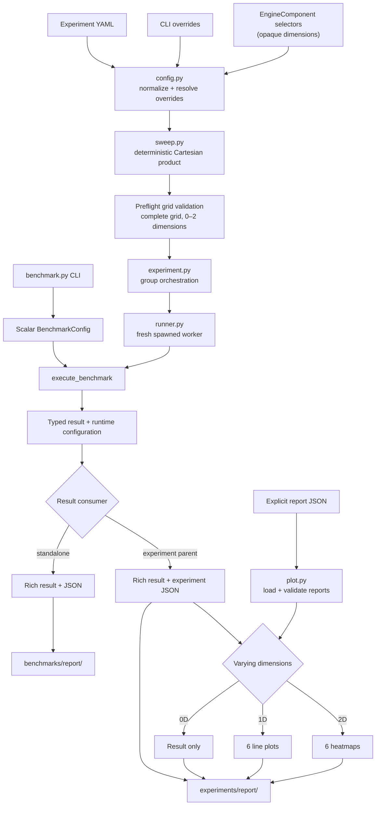

<div align="center">

<h1>Ultra-Nano-vLLM</h1>

<p><strong>測量、隔離、分析、最佳化。</strong></p>
<p>為 nano-vLLM 建立的可重現效能研究工作流程。</p>

<p>
  <a href="pyproject.toml"></a>
  <a href="#installation"></a>
  <a href="#research-workflow"></a>
  <a href="LICENSE"></a>
</p>

<p>
  <a href="README.md">English</a> ·
  <a href="README.zh-TW.md">繁體中文</a> ·
  <a href="README.zh-CN.md">简体中文</a>
</p>

<p>
  <a href="#architecture">架構</a> ·
  <a href="#installation">安裝</a> ·
  <a href="#benchmark">Benchmark</a> ·
  <a href="#experiments">Experiment</a> ·
  <a href="#pluggable-design">可插拔設計</a> ·
  <a href="#research-workflow">研究流程</a>
</p>

</div>

Ultra-Nano-vLLM 是一個以
[nano-vLLM](https://github.com/GeeeekExplorer/nano-vllm) 為基礎的效能研究專案。
它將輕量推論引擎轉化為受控研究環境，用於測量變更、分析已確認的瓶頸，
並以可重現的 baseline 驗證最佳化結果。

| Benchmark | Experiment | Optimize |
| --- | --- | --- |
| 記錄結構化的延遲、吞吐量與 KV-cache 使用量測量。 | 透過已驗證的 YAML 網格隔離 scalar、component 與 kernel 的影響。 | Profile 已確認的 workload、替換聚焦的實作並比較 regression。 |

> **研究循環：** benchmark → controlled experiment → profiling → optimization → regression comparison

<a id="architecture"></a>

## 架構

研究流程刻意與推論引擎實作細節分離。Benchmark 與 experiment entrypoint
只傳遞不透明的 `EngineComponent` selection，不決定組件如何實作。
替換 contract 請參閱[可插拔設計](#pluggable-design)。



### 原始碼導覽

| 區域 | 職責 |
| --- | --- |
| `benchmarks/benchmark.py` | 定義單次 scalar benchmark config 與測量生命週期。 |
| `benchmarks/runner.py` | 將 workload 接至 LLM API，並擷取 runtime 與 KV-cache block 使用量。 |
| `experiments/config.py` | 載入 YAML、套用 override、推斷維度並驗證網格。 |
| `experiments/sweep.py` | 依確定性的笛卡爾積順序展開正規化選項。 |
| `experiments/experiment.py` | 編排群組、parent-side reporting 與 plot dispatch。 |
| `experiments/runner.py` | 在全新的 spawned process 中執行每組 scalar config。 |
| `experiments/plot.py` | 載入報告並繪製不同維度的比較圖。 |
| `utils/reporter.py` | 顯示 Rich 輸出並保存 typed JSON report。 |

架構不變條件：

- Benchmark 與 experiment entrypoint 維持 engine-agnostic。
- 每個 YAML 檔案各自形成獨立的繪圖群組。
- GPU 工作開始前，必須驗證最多二維且完整、唯一的參數網格。
- Scalar experiment 依序執行、使用獨立 process，並要求明確 cleanup。
- Typed result 回傳 parent process 後才進行 reporting 與 plotting。
- Plot-only mode 只讀取使用者明確提供的 report file。

<a id="installation"></a>

## 安裝

<details open>
<summary><strong>環境與相依套件</strong></summary>

<br>

Ultra-Nano-vLLM 支援 Python 3.10–3.12，並需要 NVIDIA GPU、相容的 CUDA 環境、
PyTorch、Triton 與 FlashAttention。下列命令以 CUDA 12.8 為目標；若 CUDA 環境不同，
請使用 [PyTorch installer](https://pytorch.org/get-started/locally/) 產生的命令。

```bash
python -m venv .venv
source .venv/bin/activate
python -m pip install --upgrade pip setuptools wheel
python -m pip install torch==2.8.0 --index-url https://download.pytorch.org/whl/cu128
python -m pip install ninja packaging psutil
MAX_JOBS=2 python -m pip install "flash-attn>=2.8.3,<2.9" --no-build-isolation
python -m pip install -e .
```

`MAX_JOBS=2` 用於限制建置 FlashAttention 時的記憶體用量，可依機器資源調整。

</details>

<details open>
<summary><strong>本機模型準備</strong></summary>

<br>

Benchmark 使用本機模型路徑。隨附的 experiment config 預設使用
`~/huggingface/Qwen3-0.6B/`，例如：

```bash
huggingface-cli download --resume-download Qwen/Qwen3-0.6B \
  --local-dir ~/huggingface/Qwen3-0.6B/ \
  --local-dir-use-symlinks False
```

</details>

<a id="benchmark"></a>

## 執行 Benchmark

使用 `benchmarks/benchmark.py` 執行一組 scalar config：

```bash
python benchmarks/benchmark.py \
  --model ~/huggingface/Qwen3-0.6B/ \
  --num-requests 256 \
  --input-len 1024 \
  --output-len 256 \
  --temperature 0 \
  --repeats 3 \
  --experiment-name baseline
```

`temperature: 0` 代表 greedy decoding；正溫度使用 stochastic sampling。
加入 `--enforce-eager` 可停用 CUDA graph 執行。

Benchmark 會顯示 Rich 結果表，並將 JSON 報告寫入 `benchmarks/report/`。
每份報告包含 workload 總量、時間與吞吐量的 median/minimum/maximum、
KV-cache peak used blocks 與 peak utilization。

<a id="experiments"></a>

## 執行受控 Experiment

Experiment YAML 的每個欄位都可以提供單一值或值列表。列表會展開為確定性的笛卡爾積，
且每個展開後的 run 都必須具有唯一的 `experiment_name`。

```yaml
model: ~/huggingface/Qwen3-0.6B/
num_requests: 256
input_len: [512, 1024]
output_len: 256
seed: 0
temperature: 0
repeats: 3
enforce_eager: [false, true]

scheduler: scheduler
block_manager: block_manager
attention: attention
sampler: sampler
store_kvcache: store_kvcache

experiment_name:
  - input-512-cuda-graph
  - input-512-eager
  - input-1024-cuda-graph
  - input-1024-eager
```

這是一個完整的二維網格（`input_len` × `enforce_eager`）。執行方式如下：

```bash
python experiments/experiment.py --config experiments/configs/your-config.yaml
```

重複傳入 `--config` 可以執行多個 YAML；每個檔案仍是獨立的繪圖群組：

```bash
python experiments/experiment.py \
  --config experiments/configs/baseline-input-sweeps.yaml \
  --config experiments/configs/baseline-output-sweeps.yaml
```

Benchmark CLI option 可以在該次執行中覆寫 YAML 的 scalar value：

```bash
python experiments/experiment.py \
  --config experiments/configs/baseline-input-sweeps.yaml \
  --temperature 0 \
  --repeats 5
```

每個 experiment group 最多只能變化兩個 scalar、component 或 kernel 維度。
完整網格與全域唯一的 experiment name 會在任何 GPU 工作開始前完成驗證。
每組 scalar config 會依序在全新的 spawned process 中執行，避免 CUDA graph pool、
cached allocation 或 NCCL process-group state 洩漏至下一次測量。

報告與 PNG 圖表會寫入 `experiments/report/`：

- 0 個變化維度：僅產生 Rich 結果與 JSON 報告。
- 1 個變化維度：產生六張 median 折線圖；時間與吞吐量圖包含 min/max band。
- 2 個變化維度：產生六張附註 median 的 heatmap；時間與吞吐量 cell 也會顯示 min/max。

六項繪圖指標為 elapsed time、request throughput、output throughput、total throughput、
peak KV-cache blocks 與 peak KV-cache utilization。

可以只使用既有 experiment 報告重新繪圖，而不執行模型：

```bash
python experiments/experiment.py --plot-only \
  experiments/report/run-a.json \
  experiments/report/run-b.json
```

只有明確列出的報告會組成該繪圖群組，且必須包含相容的 `experiment_config` 與 result payload。
僅包含舊版 GPU allocator peak 欄位的報告，必須重新執行實驗後才能用於 plot-only mode。

<a id="pluggable-design"></a>

## 可插拔的 Component 與 Kernel

`EngineComponent` 讓 benchmark 與 experiment entrypoint 不需要理解推論引擎的實作細節。
每個 selector 都是固定角色目錄下的安全本機檔名 stem；支援 `my-scheduler-v1.py`
這類含連字號的名稱，但拒絕 path 與 `..`。

<details>
<summary><strong>Implementation contract 與 Python API</strong></summary>

<br>

| YAML selector | Implementation location | Required factory |
| --- | --- | --- |
| `scheduler` | `nanovllm/engine/scheduler/<selector>.py` | `create_component(config=..., block_manager=...)` |
| `block_manager` | `nanovllm/engine/block_manager/<selector>.py` | `create_component(num_blocks=..., block_size=...)` |
| `attention` | `nanovllm/layers/attention/<selector>.py` | `create_component(num_heads=..., head_dim=..., scale=..., num_kv_heads=..., store_kvcache=...)` |
| `sampler` | `nanovllm/layers/sampler/<selector>.py` | `create_component()` |
| `store_kvcache` | `nanovllm/kernels/store_kvcache/<selector>.py` | `create_kernel()` |

Factory 回傳值必須符合 `nanovllm.engine.component` 中該角色的 runtime-checkable Protocol。
Attention factory 會收到選定的 store-KV-cache callable，因此 Triton 或 CUDA kernel wrapper
也能使用相同的替換機制。省略 selector 時，會使用前述 YAML 範例中的 baseline 檔名。

如需比較新的 scheduler，請先新增
`nanovllm/engine/scheduler/my-scheduler-v1.py` 並實作必要 factory，再設定 categorical sweep：

```yaml
scheduler: [scheduler, my-scheduler-v1]
block_manager: block_manager
attention: attention
sampler: sampler
store_kvcache: store_kvcache
```

`my-scheduler-v1` 只是示意名稱，並非 repository 隨附的 implementation。
其他 component 與 kernel 目錄也使用相同慣例。

Python caller 也能直接使用 selection API：

```python
from nanovllm import EngineComponent, LLM

components = EngineComponent(scheduler="my-scheduler-v1")
llm = LLM(
    "/YOUR/MODEL/PATH",
    enforce_eager=True,
    tensor_parallel_size=1,
    engine_component=components,
)
```

</details>

<a id="research-workflow"></a>

## 研究工作流程

1. 為待研究的 workload 建立可重現的 scalar benchmark。
2. 使用一維或二維 experiment 隔離相關影響。
3. Profile 已確認的 workload，找出實際瓶頸。
4. 新增聚焦的 component、kernel 或 engine 最佳化，同時維持正確性與公開行為。
5. 重新執行相同 benchmark grid，比較保存的報告以確認效能改善與 regression。

目前 repository 不強制指定 profiling framework、命令或 artifact 目錄。

<details>
<summary><strong>開發驗證</strong></summary>

<br>

若 repository virtual environment 存在，優先使用它：

```bash
.venv/bin/python -m unittest discover
.venv/bin/python -m compileall -q benchmarks experiments nanovllm utils
git diff --check
```

若 `.venv/bin/python` 不可用，請改用 `python3`。Unit test 應 mock model loading
與昂貴的 GPU 工作；沒有合適的 NVIDIA GPU、CUDA 環境及本機模型時，不要執行真實 benchmark。

`benchmarks/report/` 與 `experiments/report/` 下的生成結果應保持 untracked。

</details>

## 與 nano-vLLM 的關係

Ultra-Nano-vLLM 建立於
[GeeeekExplorer/nano-vllm](https://github.com/GeeeekExplorer/nano-vllm)
的輕量推論引擎之上。上游專案提供易讀的 nano-vLLM 實作；本 repository 則加入
benchmark、受控 experiment、reporting、plotting、process isolation 與可插拔 selection
基礎設施，以支援 evidence-driven optimization workflow。

授權資訊請參閱 [LICENSE](LICENSE)。
